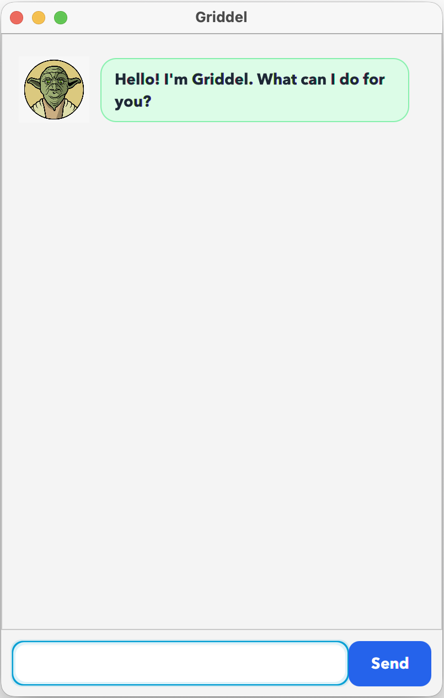

# Griddel User Guide

Griddel is a task-management chatbot that helps you create, organise,
prioritise, and search your tasks. You can use Griddel through the JavaFX
graphical interface or the command-line interface.



## Getting started

Launch the graphical interface with:

## Typical GUI workflow

1. Launch Griddel with `./gradlew run`.
2. Enter a command in the input box.
3. Press **Enter** or click **Send**.
4. Griddel displays your input and its response in separate message bubbles.
5. Error messages are highlighted so that invalid commands are easy to notice.

```bash
./gradlew run
```

Type a command in the input box and press **Enter** or click **Send**.

## Adding tasks

### Todo

Adds a task without a date.

```text
todo revise JavaFX
```

### Deadline

Adds a task with a deadline. Use the date format `yyyy-mm-dd`.

```text
deadline submit report /by 2026-09-20
```

### Event

Adds an event that occurs between two dates.

```text
event project meeting /from 2026-09-20 /to 2026-09-21
```

## Managing tasks

```text
list
mark 1
unmark 1
delete 1
```

- `list` displays all tasks.
- `mark 1` marks task 1 as completed.
- `unmark 1` marks task 1 as incomplete.
- `delete 1` removes task 1.

Task numbers are one-based and follow the order shown by `list`.

## Searching tasks

Find tasks containing a keyword:

```text
find report
```

Check which deadline or event tasks occur on a date:

```text
check 2026-09-20
```

## Task priorities

Assign a priority to a task using `high`, `medium`, `low`, or `none`:

```text
priority 1 high
priority 2 medium
priority 3 low
```

Display only tasks with a selected priority:

```text
filter priority high
filter priority medium
filter priority low
filter priority none
```

Display tasks from highest to lowest priority:

```text
sort priority
```

Sorting is non-destructive. It displays a sorted view without changing the
original task order. Use `list` to display the original order again.

## Saving tasks

Griddel automatically saves changes locally, so your tasks remain available
after restarting the application.

## Exiting Griddel

```text
bye
```

This displays a goodbye message and closes the application.
